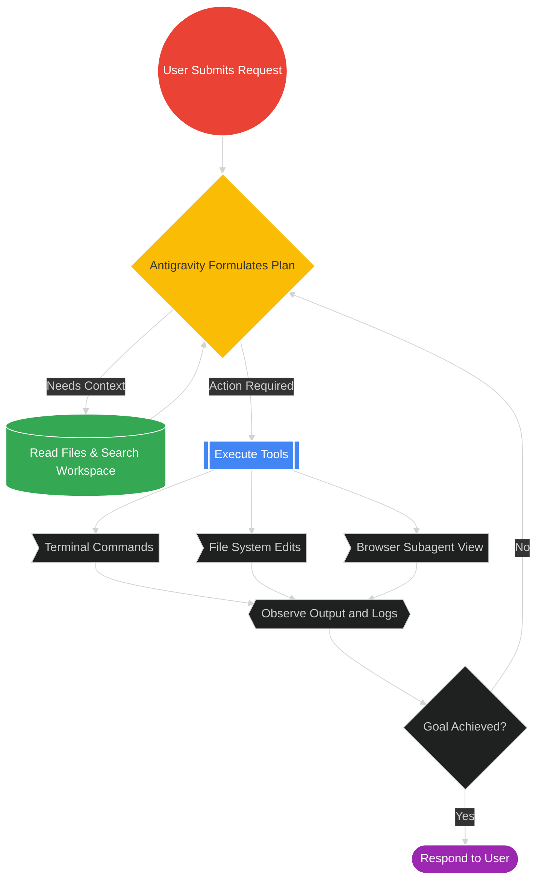
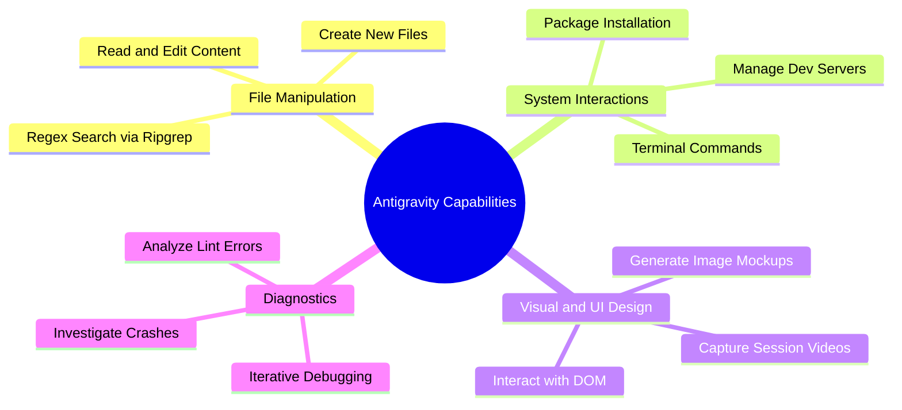
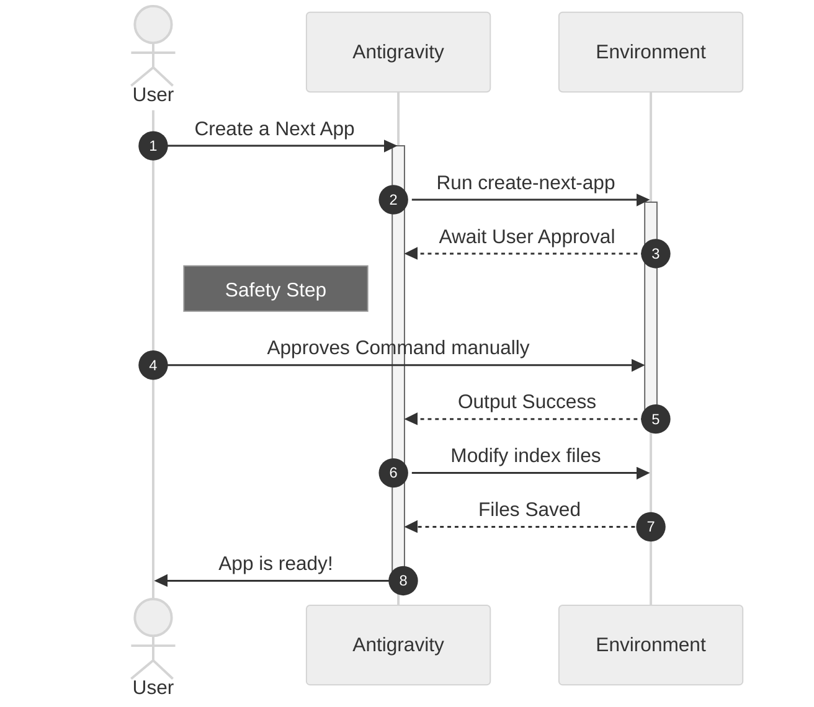
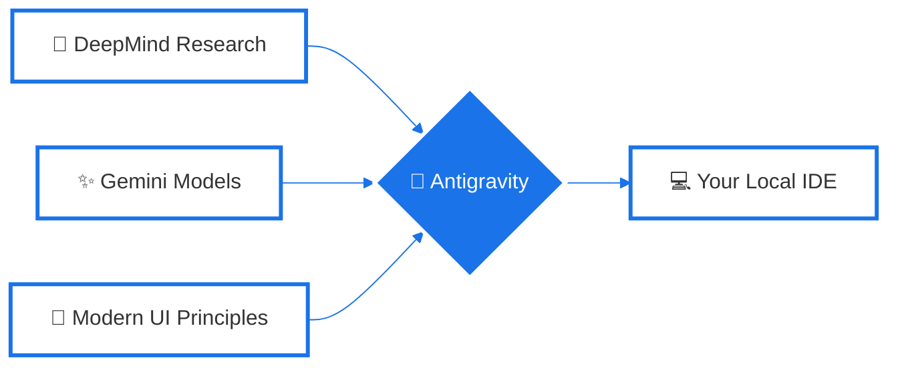

# Antigravity 101: The Comprehensive Learning Course

Welcome to the **Antigravity 101** course! This curriculum is designed to teach you about Antigravity, a powerful, agentic AI coding assistant built by the Google DeepMind Advanced Agentic Coding team. 

In this course, we will explore what Antigravity is, how it functions autonomously, and how you can best collaborate with it to dramatically accelerate your development.

---

## Module 1: Introduction to Agentic AI

### What is Antigravity?
Antigravity is an active, autonomous pair-programming partner. Unlike passive chat assistants that only answer questions, Antigravity functions as an *agent*. It operates directly within your IDE and workspace, capable of breaking down complex problems and executing real actions in your environment.

### The Agentic Loop
Below is an overview of how Antigravity processes your requests and interacts with the environment iteratively until the goal is completed:

---

## Module 2: Core Capabilities and The Toolbelt

Antigravity isn't just generating text; it has a vast array of robust tools. Here is an overview of its core capabilities represented as a mindmap:

### Breakdown of Key Features:
* **Full-Stack Development:** Build complete applications, configure tools, and scaffold complex architectural setups from zero.
* **Autonomous File Manipulation:** Navigate local directories, read code accurately, and apply precise diff patches to multiple files at once.
* **Browser Integration:** Spawn an independent visual subagent that can browse websites, inspect document structure, interact with elements, and record videos of user workflows for testing.

---

## Module 3: Piloting Antigravity Effectively

Learning to pilot an AI agent effectively means understanding how to craft instructions and how the feedback loop operates.

### Best Practices for Collaboration
1. **Be Direct and Specific:** Provide clear initial objectives.
2. **Review Terminal Actions:** For your safety, Antigravity pauses when invoking shell commands with potentially destructive side effects. The command will pause until you actively approve it.
3. **Conversational Refinement:** If a feature isn't working, simply report the exception. Antigravity maintains history and will adjust code based on the feedback.

### Your Interaction Workflow

---

## Module 4: Rooted in the Google Ecosystem

Antigravity represents a blend of advanced systems coming out of Google DeepMind research and applied AI engineering.

* **Powered by Gemini:** Currently utilizing state-of-the-art models which allow for massive context windows, ultra-fast multimodal reasoning, and deep code comprehension.
* **Top-Tier Design Aesthetics:** Programmed with high-end modern web design guidelines.
* **Persistent Memory Architecture:** Leverages an internal system to compile Knowledge Items during conversations.

---

**End of Course!** You are now ready to wield the full power of Antigravity in your daily development lifecycle.
