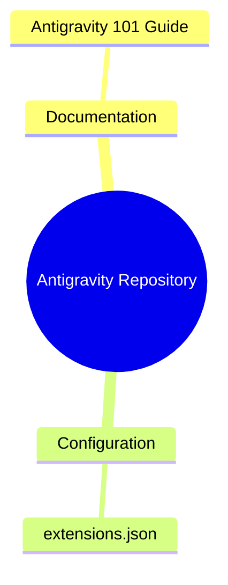
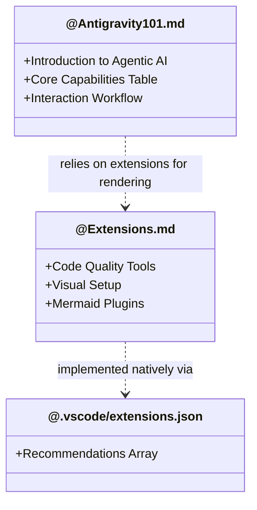

# Antigravity Project Architecture

Following our new documentation rules, this file visualizes the structure and logic of the Antigravity setup.

## 1. Technical Requirements & Components (Scannable Table)

| Component | Role | Status |
| :--- | :--- | :--- |
| **Antigravity AI Agent** | Autonomous coding, environment interaction, problem solving | Active |
| **Mermaid JS** | Documentation visualization (Flowcharts, Mindmaps) | Integrated |
| **VS Code Workspace** | Developer environment, previewers, extensions | Configured |

## 2. Feature Hierarchy (Mind Map - Syntax Verified)
This mind map breaks down the repository's feature hierarchy. *Note: Syntax was verified using the Antigravity Browser subagent on Mermaid Live before formatting.*

## 3. Visual Code Mapping (Class Diagram)
A structural map of our existing files and dependencies.

## 4. Media Artifact Generated
As requested, after testing the highly complex Mermaid mindmap syntax logic, the agent generated the following recording showing the successful visual result of the rendered map!

