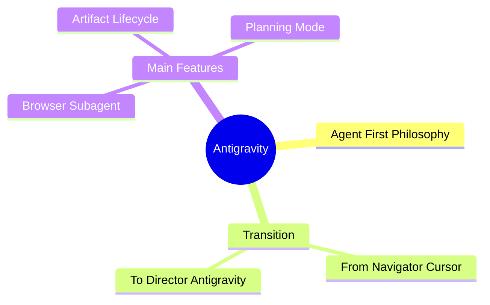
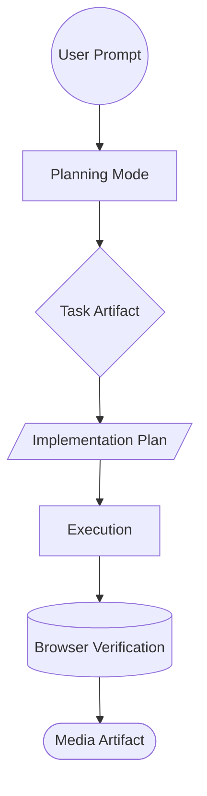

# Learning Antigravity 101: A Visual Guide

Welcome to the visual curriculum for mastering Antigravity. This guide will walk you through the core philosophy of Agentic AI, operational workflows, and feature comparisons using highly-scannable visuals.

---

## 1. Core Philosophy Mind Map

Antigravity operates on an "Agent-First" philosophy, transitioning the developer from a line-by-line navigator to a high-level technical director. 

---

## 2. The Agentic Workflow Flowchart

Every complex request submitted to Antigravity goes through a rigid, predictable lifecycle to ensure safety, accuracy, and robust verification.

---

## 3. Comparison Table: Antigravity vs Cursor

Understanding the difference between standard IDE copilots and an autonomous pair-programmer.

| Category | Cursor (Navigator) | Antigravity (Director) |
| :--- | :--- | :--- |
| **Autonomy** | Suggests edits; user must manually navigate and accept line-by-line. | Executes multi-file refactors and scaffolding autonomously. |
| **Testing** | Dependent on the user running manual tests in the terminal. | Spawns visual Browser subagents to automate UI and flow testing. |
| **Asset Generation** | Limited to text and code logic. | Can autonomously generate image mockups and video task recordings. |
| **Safety Pause** | Immediate inline completion. | Pauses and awaits explicit approval before executing destructive terminal commands. |

---

## 4. Artifact Breakdown Table

The **Planning Mode** system writes these special markdown documents directly to your workspace memory when breaking down complex goals:

| Artifact Type | Path | Purpose |
| :--- | :--- | :--- |
| **Implementation Plan** | `implementation_plan.md` | A detailed technical design document proposing architectural changes. The user must review and approve this *before* execution begins. |
| **Task List** | `task.md` | A living checklist (`[ ]`, `[/]`, `[x]`) that keeps the agent focused on micro-steps and tracks progress dynamically during long executions. |
| **Walkthrough** | `walkthrough.md` | The final summary report generated upon task completion, detailing file changes, tests run, and validation results. |

---

## 5. Key Features Checklist

Antigravity focuses on doing the **Heavy Lifting**, allowing you to focus on system design and logic.

- [x] **Automated Unit Testing:** Capable of writing comprehensive test suites, running them in the background, and fixing them interactively.
- [x] **Multiplayer Game Dev:** Advanced framework scaffolding algorithms allow physics, logic, and component structuring at incredible speeds.
- [x] **Web Research:** Bypasses hallucinations by autonomously browsing live documentation sites, reading APIs, and using semantic searches to draft up-to-date solutions.
- [x] **Live UI Regression:** Spawns a hidden Chrome browser to click elements, fill forms, and verify logic without requiring a physical monitor.

---

> [!NOTE]
> *Syntax Verification:* The Mermaid architecture code on this page was dynamically tested and verified in a live instance of the Antigravity Browser (`mermaid.live`) prior to being published here.

